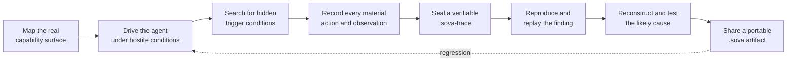
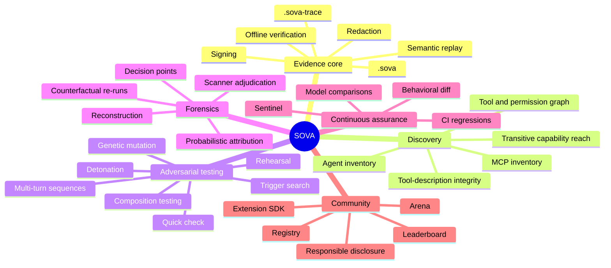
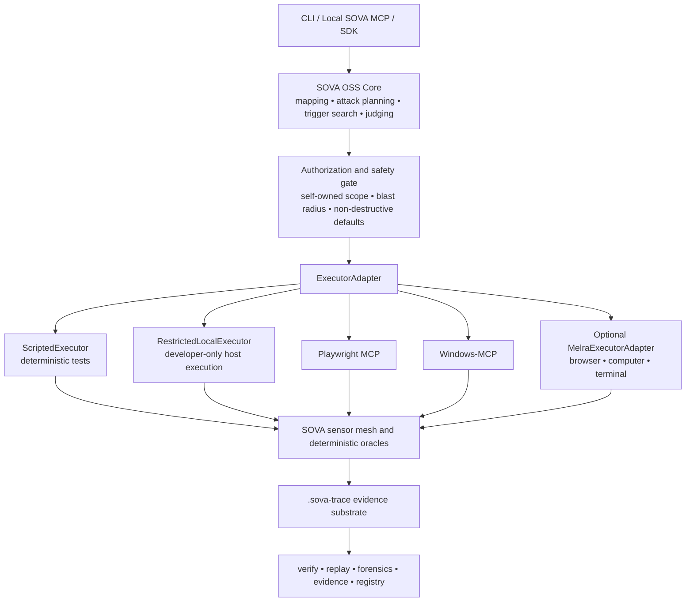

<p align="center">
  
</p>

<h1 align="center">S.O.V.A.</h1>

<p align="center">
  <strong>The open-source portable record for AI behavior.</strong>
</p>

<p align="center">
  Record what happened. Package the conditions. Replay the evidence.<br/>
  Reproduce the behavior. Compare systems. Share research others can inspect.
</p>

<p align="center">
  <a href="https://truscor.org"></a>
  <a href="https://github.com/Gautam-R-Patil/S.O.V.A---OSS---TRUSCOR"></a>
  <a href="./LICENSE"></a>
  
  
  
</p>

<p align="center">
  <a href="#why-sova">Why SOVA</a> •
  <a href="#what-sova-is-building">Capabilities</a> •
  <a href="#how-the-system-fits-together">System</a> •
  <a href="#the-developer-experience">Usage</a> •
  <a href="#safety-by-construction">Safety</a> •
  <a href="#project-status">Status</a> •
  <a href="#licence-attribution-and-citation">Governance</a> •
  <a href="#connect">Connect</a>
</p>

<br/>

<p align="center">
  
</p>

---

> [!IMPORTANT]
> **SOVA is pre-alpha.** The repository now implements experimental `0.1`
> `.sova` capsule and `.sova-trace` contracts, deterministic and restricted
> local executors, observable deterministic oracles, capability mapping,
> evidence-isolated orchestration, bounded checking, exact-gated local MCP,
> fail-closed extensions/providers, evidence-first local community surfaces,
> replay, bounded trigger search, evidence-linked causal forensics, onboarding,
> release integrity, neutral conformance vectors, authorized-target planning,
> and shared domain primitives. The built-in loopback fixture now exercises a
> real browser through the pinned Playwright MCP adapter. Operator-owned HTTPS
> targets can use the short-lived well-known control-proof workflow plus exact
> interactive authorization; target-specific procedures, accounts, privacy
> review, and evidence oracles remain the operator's responsibility.

## Implemented foundation, mapping, runtime, capsules, traces, and ecosystem boundaries

The implemented Topic 02–27 engineering foundation is intentionally
experimental and honest:

```bash
git clone https://github.com/Gautam-R-Patil/S.O.V.A---OSS---TRUSCOR.git
cd S.O.V.A---OSS---TRUSCOR
uv sync --locked
uv run sova --version
uv run python -m pytest
```

It provides:

- the canonical `sova-oss` Python distribution, `sova` import namespace, and
  `sova` command;
- CPython 3.11–3.14 support across Windows, macOS, and Linux CI;
- pinned JSON Schema 2020-12 validators, an optional Ed25519 signing extra, and
  no SOVA-hosted service requirement;
- locked development dependencies, formatting, linting, strict typing, branch
  coverage, dependency audit, CodeQL, secret scanning, and build checks;
- deterministic seeds, compatibility directories, provenance-controlled
  goldens, performance budgets, fault injection, and crash recovery tests;
- permanent decision, invention, claim, research-artifact, methodology,
  glossary, changelog, security, and release-control homes.
- strict semantic versions, SHA-256 fingerprints, UUIDv7 logical identifiers,
  explicit absence semantics, and stable machine-classifiable contract errors;
- a non-destructive five-axis finding lifecycle and version-qualified external
  vulnerability references;
- the experimental twelve-class `sova.attack` taxonomy with standard/custom
  profile rules and pinned interoperability mappings;
- a six-dimensional observed-coverage vector with frozen denominators,
  exploration budgets, stopping rules, and no universal “percent safe” score.
- deterministic, hostile-input-aware `.sova` packages with content-addressed
  objects, authoring templates, validation, linting, rendering, hashing, and
  chained migrations;
- streaming `.sova-trace` event segments, capture-time redaction, blob
  deduplication, event hash chains, optional DSSE-compatible Ed25519 signatures,
  offline verification, queries, and inert playback;
- pinned OpenTelemetry `1.43.0` and OpenInference `0.1.30` mappings that report
  fidelity loss instead of inventing missing evidence.
- an exact versioned executor capability contract, deterministic
  `ScriptedExecutor`, and an explicitly non-sandboxed `RestrictedLocalExecutor`
  with strict opaque secret references, supervised child processes, visible
  unsupported resource limits, and explicit crash evidence;
- deterministic observable oracles and an integrity-checked declared-outcome
  comparator that returns `inconclusive` when required evidence was lost;
- a safe complete no-Atlas capsule → trace → playback → controlled execution →
  comparison → evidence-capsule → independent-offline-verification fixture.
- air-gapped `sova map` discovery with a typed capability graph, redacted edge
  provenance, declared/witness-linked/possible/conflict closures, and immutable
  tool-definition drift snapshots;
- provider-neutral runtime roles, standard/custom profiles, bounded mutation,
  an evidence firewall that excludes attacker assertions from factual judge
  input, deterministic oracle/policy precedence, and explicit inconclusive and
  human-review states;
- `sova check` and a complete repeated `sova demo sleeper` workflow producing
  signed traces, a portable capsule, a fresh reproduction, and a concise report.
- account-free local initialization, credential-safe diagnostics, reviewed
  managed-data deletion, first-run guides, and air-gapped operation;
- deterministic CycloneDX 1.6 SBOMs, release checksums with undeclared-file
  detection, and reproducible independent conformance kits;
- secret-free authorized target contracts and deterministic website/software
  assessment fixtures that validate the complete evidence pipeline without
  claiming that a live target was exercised.
- an authorization-gated real-browser vertical slice that launches a self-owned
  loopback website, drives Chrome through pinned Playwright MCP, records signed
  primary and reproduction traces, compares observable outcomes, and packages
  the evidence as a `.sova` capsule.

Read [ADR-0007](./docs/decisions/0007-topic-02-engineering-foundation.md),
[ADR-0008](./docs/decisions/0008-topic-03-domain-contracts.md), the
[shared contracts](./docs/contracts/README.md), and the
[experimental format specifications](./docs/specifications/README.md).

## Why SOVA

AI agents do more than generate text. They browse, execute commands, call MCP servers, use tools, read and write memory, retrieve private context, modify files, operate interfaces, and delegate work to other agents.

That creates a new security problem:

- A static scanner can inspect what a component **looks like**.
- A one-shot test can observe what it did **once**.
- A recorder can preserve what happened **afterward**.
- A benchmark can test a fixed scenario that may already be known.

But the failures that matter can hide behind a particular phrase, file, tool order, permission, memory state, invocation count, previous conversation, or combination of individually harmless components.

SOVA is being built to connect the entire security loop:



SOVA is not intended to be another disconnected scanner or observability
dashboard. It is intended to become a shared evidence and experimentation layer
for AI development, evaluation, interpretability, incident analysis, behavioral
research, and security.

## The owl

**Sova** means **owl** in Serbian and is the transliteration of the Russian word **сова**.

The owl represents the product we want to build:

- watchful enough to see the entire system;
- patient enough to find behavior that stays dormant;
- precise enough to distinguish evidence from assumption;
- independent enough to let anyone verify the result.

## What SOVA is building

SOVA is organized around one always-on evidence substrate and a set of connected security verbs.

<table>
  <tr>
    <td width="14%" align="center"><strong>RECORD</strong></td>
    <td><code>sova trace</code> captures model, tool, MCP, memory, retrieval, process, browser, computer, and egress activity into a versioned <code>.sova-trace</code>.</td>
  </tr>
  <tr>
    <td align="center"><strong>DISCOVER</strong></td>
    <td><code>sova map</code> inventories agents, tools, skills, MCP servers, identities, permissions, approval gates, egress paths, and transitive capability reach.</td>
  </tr>
  <tr>
    <td align="center"><strong>TEST</strong></td>
    <td><code>sova check</code>, <code>detonate</code>, <code>compose</code>, <code>rehearse</code>, and <code>arena</code> exercise components and complete agents inside controlled environments.</td>
  </tr>
  <tr>
    <td align="center"><strong>EXPLAIN</strong></td>
    <td><code>sova forensics</code> reconstructs the run, identifies decision points, and evaluates causal hypotheses through controlled counterfactual re-runs.</td>
  </tr>
  <tr>
    <td align="center"><strong>PROVE</strong></td>
    <td><code>sova verify</code>, <code>replay</code>, and <code>evidence</code> turn observations into reproducible, redaction-aware evidence—not unsupported assurance.</td>
  </tr>
  <tr>
    <td align="center"><strong>WATCH</strong></td>
    <td><code>sova sentinel</code>, behavioral <code>diff</code>, and CI regression testing detect when a model, component, permission, or tool update changes security behavior.</td>
  </tr>
  <tr>
    <td align="center"><strong>SHARE</strong></td>
    <td><code>sova registry</code>, <code>adjudicate</code>, and <code>disclose</code> make findings portable, reviewable, responsibly publishable, and independently reproducible.</td>
  </tr>
</table>

### The headline capability: find the sleeper

A component may behave safely for hundreds of runs and activate only when:

- a particular word appears;
- a file exists;
- the invocation counter reaches a threshold;
- the agent has accumulated a specific memory;
- one tool has already been called;
- the environment contains a particular secret or permission;
- an individually benign component is combined with another.

SOVA plans to search this **conditional-trigger space** systematically rather than running only a fixed attack list.

The public claim will be earned experimentally: SOVA must repeatedly find confirmed behavior that strong baselines miss before we say that it does.

### `.sova` — a portable AI-behavior capsule

A `.sova` file is now implemented experimentally as an open, versioned,
inert-by-default capsule that can organize:

- a portable scenario or replay recipe;
- triggers, parameters, preconditions, environment, and dependencies;
- agents, models, tools, protocols, and runtime versions;
- `.sova-trace` records and content-addressed artifacts;
- assertions, evaluations, findings, and hypotheses;
- safety, authorization, limitations, disclosure, and cleanup information;
- authorship, provenance, integrity, licence, and citation information.

It supports security cases, evaluations, agent trajectories, behavioral
interpretability, incident forensics, and research publication. The minimum
capsule remains small: a manifest and one typed object. Rich traces and large
artifacts are optional.

Opening, inspecting, verifying, rendering, or migrating a capsule never runs
its scenario, installs tools, fetches URLs, or invokes a model. Controlled
re-execution is a separate, explicitly authorized operation.

### `.sova-trace` — the evidence record

A `.sova-trace` now experimentally carries:

- ordered events and causal relationships;
- model, tool, MCP, memory, retrieval, process, network, browser, and computer observations;
- target, environment, methodology, taxonomy, model, and executor fingerprints;
- attack, judge, oracle, reproduction, and forensic context;
- redaction metadata;
- artifact hashes;
- a standard signed envelope and offline verification path.

SOVA builds on open telemetry and signing conventions rather than inventing
private cryptography. Its claims are bounded by the published
[threat model](./docs/specifications/threat-model.md).

The accepted [capsule and trace decision](./docs/decisions/0009-sova-behavior-capsule-and-trace-model.md)
keeps scenarios, traces, findings, evaluations, reports, and registry entries
separately typed inside or alongside the outer capsule.

### Versioning without lock-in

The accepted [versioning and lossless-migration policy](./docs/decisions/0002-versioning-and-lossless-migration.md) is designed so a future SOVA release can continue reading every stable `.sova` version and migrate old artifacts forward without silent data loss.

The promise is deliberately precise:

- the original file is never overwritten by default;
- every source value, payload, attachment, ordering rule, oracle, and safety constraint is preserved;
- implicit old defaults become explicit equivalent values;
- future-only information that did not exist is marked `unknown`, never fabricated;
- unsupported required behavior fails closed;
- the migrated artifact keeps provenance to the original digest but receives its own digest and signature.

The current experimental local workflow is:

```bash
sova validate behavior.sova
sova inspect behavior.sova
sova migrate behavior-v001.sova behavior-v010.sova --to 0.1.0
```

SOVA will use experimental `0.x` schemas until real scenarios, migration rehearsals, independent implementations, and hostile-input tests justify `1.0.0`.

### Semantic reproduction

Hosted model execution is not reliably bit-for-bit deterministic. SOVA therefore separates:

1. **Trace playback** — inspect exactly what was recorded.
2. **Controlled re-execution** — rerun under pinned or equivalent conditions.
3. **Semantic reproduction** — test whether the same material security outcome recurs.

Instead of hiding nondeterminism, SOVA plans to report repeated trials, condition drift, and a reproduction rate.

## Capability map



## How the system fits together

SOVA owns the security method and evidence. Execution providers remain replaceable.



### MELRA (formerly Atlas MCP / Atlas OS)

[MELRA](https://github.com/XAGI-Lab/melra), created by Dheeraj S at [XAGI Labs](https://xagilabs.com), is implemented as an optional execution adapter for:

- browser use;
- computer use;
- terminal use.

SOVA does **not** outsource its containment admission, authorization, trigger search, observations, judging, redaction, signing, replay, forensics, or reporting to MELRA. The public capability broker works without MELRA through scripted and restricted-local executors, Microsoft Playwright MCP for browser use, and an explicitly restricted Windows-MCP adapter for optional desktop use.

MELRA is a separate XAGI Labs project, not SOVA Engine and not a source of TRUSCOR authority. Public SOVA integration will rely only on MELRA's public interface and reproducible behavior of a pinned public release; confidential Atlas/MELRA material is outside this repository.

The current MELRA audit is intentionally cautious: its Windows build and one
Windows test case failed, and a live MCP transport success contained an internal
`policy_blocked` task. SOVA therefore recognizes only MELRA's explicit
`verified_success`, treats MELRA receipts as defense-in-depth input, and can
remove MELRA without changing any artifact or evidence contract. See the
[external execution specification](./docs/specifications/external-execution-broker-0.1.md).

## Implemented evidence, replay, rehearsal, and regression core

The pre-alpha now includes:

- four-state offline verification (`verified`, `partial`, `invalid`, and
  `unsupported`);
- three separately named replay operations: inert playback, fresh controlled
  re-execution, and repeated semantic reproduction;
- side-by-side, scrubbable, XSS-safe trace visualization;
- numerator/denominator, Wilson uncertainty, condition sensitivity, and
  optional calibrated-judge reporting;
- a bounded MCP stdio client, pinned open-source launch recipes, capability
  routing, evidence normalization, and conservative fallback;
- a 13-dimension trigger-space model with independently measurable signature,
  random, grid, coverage, human, and adaptive baselines;
- deterministic minimization into portable `.sova` intent; and
- an owned-target-only Phantom Fuzzer contract with in-memory token zeroization.
- credential-stripped, substitute-only rehearsal with signed failure/success
  traces and digest-bound selective export;
- shell-free local process tracing, environment/behavior/methodology drift,
  local sentinel history, CI/SARIF output, and file-integrity self-checks; and
- a signed, content-addressed, offline registry with pull-only mirror caching
  and human-confirmed local contribution staging.
- an MCP `2025-11-25` stdio server whose offensive tools require exact,
  expiring, single-use human approval through a separate local control channel;
- a digest-pinned MCP manifest and `sova check --self` drift check, with
  checksum and GitHub/Sigstore provenance generation for release candidates;
- eight typed extension kinds, metadata-only PyPA discovery, and a bounded
  subprocess JSONL compatibility path that is explicitly not a security sandbox;
- credential-late OpenAI, Anthropic, OpenRouter, and loopback Ollama adapters,
  explicit role routing and model-swap envelopes, and no-network fake transports;
- eight target-manifest kinds and a provenance-preserving Inspect AI Sample
  JSON/JSONL bridge that reports conversion loss instead of executing setup;
- freshness/scope/nonce-bound probe verification, a deterministic local Arena
  with trace-and-capsule evidence per attempt, a static evidence-gated
  leaderboard, an inert CTF catalog, and redaction-first captioned Y4M clips.

These are implemented engineering capabilities, not a claim that the current
generic search algorithm is novel or superior on real systems.

## Capability surface and remaining expansion

The implemented core above is the base. The remaining product expansion is:

### Discover

- Agent, sub-agent, skill, plugin, MCP server, and tool inventory.
- Declared, observed, and inferred capability graph.
- Identity, credential, permission, approval, and egress paths.
- Transitive “tools of tools” reach.
- Risk-classified attack-surface denominator.
- Tool-description and schema rug-pull detection.

### Test

- Sixty-second bounded component check with an explicit detection floor.
- Isolated detonation with synthetic secrets, files, databases, APIs, and services.
- Canary credentials and sink-only network honeypots.
- Multi-turn adversarial sequences.
- Conditional-trigger search across content, state, timing, invocation count, memory, filesystem, permission, and composition.
- Genetic/evolutionary mutation from successful and near-successful attempts.
- Composition testing for emergent chains.
- Safe rehearsal of real tasks against credential-stripped environment clones.
- Standard comparable profile and fully customizable non-comparable profile.

### Observe and judge

- Deterministic file, process, network, tool, permission, page, API, database, and canary oracles.
- Memory, retrieval, MCP, inter-agent, browser, and computer sensors.
- Independent Attacker and Judge roles.
- Rule and deterministic evidence before model judgment.
- Inconclusive and uncertainty states instead of forced verdicts.
- Adversary-effort metrics: turns, tokens, time, attempts, and mutations to success.

### Explain

- Cross-layer timeline reconstruction.
- Decision-point highlighting.
- Competing causal hypotheses.
- Counterfactual reruns with one candidate layer changed.
- Probabilistic attribution to model, prompt, orchestration, tool, permission, memory, handoff, or environment.
- Explicit sensor gaps and confounding factors.

### Prove and reproduce

- Portable adversarial scenarios.
- Signed, timestamped, redaction-aware traces under a stated threat model.
- Offline verification.
- Controlled re-execution.
- Semantic reproduction rate.
- Technical evidence packages with methodology and taxonomy versions.
- Self-assessment watermarking—never a self-issued certificate.

### Watch and share

- Behavioral regression diffing.
- Local sentinel runs.
- CI policy and pull-request evidence.
- Public, mirrorable registry of reviewed `.sova` artifacts.
- Execution-based scanner adjudication.
- Coordinated disclosure workflow.
- Reproducible component and model leaderboard.
- Local Arena and CTF modes.
- Captioned replay clips linked to verifiable artifacts.

## The developer experience

The intended workflow is deliberately small:

```bash
# Implemented local commands

# Discover local capability reach without executing target code
sova map ./my-agent --output ./my-agent.sova-map.json

# Exit 1 means the bundled planted behavior was confirmed
sova check synthetic-sleeper ./sova-check

# Run the complete zero-configuration proof
sova demo sleeper ./sova-demo

# Verify, inspect, compare, and visualize evidence without executing it
sova verify ./run.sova-trace
sova playback ./run.sova-trace
sova replay modes
sova replay timeline ./run.sova-trace ./replay.html --comparison ./fresh-run.sova-trace
sova replay study ./run.sova-trace ./trial-1.sova-trace ./trial-2.sova-trace

# Inspect pinned external-backend receipts and run the inert search comparison
sova executors receipts
sova hunt-demo

# Reconstruct observable evidence and assess reviewed paired interventions
sova forensics reconstruct ./incident.sova-trace
sova forensics attribute ./counterfactual-study.json
sova forensics benchmark

# Build watermarked self-assessment evidence and interoperable SARIF
sova evidence ./evidence.json --format technical
sova evidence ./evidence.json --format sarif

# Prepare an inert scanner test plan, then evaluate reviewed observations
sova adjudicate plan ./adjudication-study.json
sova adjudicate evaluate ./adjudication-study.json

# Prepare a local disclosure package; this never sends or publishes
sova disclose ./disclosure-study.json

# Plan component-chain candidates without execution, or evaluate supplied observations
sova compose plan ./composition-graph.json --strategy trigger-aware-sequence
sova compose evaluate ./composition-study.json --strategy trigger-aware-sequence

# Prepare, run, review, and selectively stage a credential-free rehearsal
sova rehearse prepare ./my-agent ./rehearsal
sova rehearse run ./rehearsal-task.json ./rehearsal ./task.sova-trace ./report.json
sova rehearse export ./report.json ./rehearsal ./accepted --approve sha256:CHANGE_ID

# Freeze and compare behavior, then run local/CI gates
sova trace snapshot ./baseline.json --output ./baseline.snapshot.json
sova trace snapshot ./current.json --output ./current.snapshot.json
sova diff ./baseline.snapshot.json ./current.snapshot.json
sova sentinel ./baseline.snapshot.json ./current.snapshot.json ./history.jsonl
sova ci ./baseline.snapshot.json ./current.snapshot.json --sarif ./sova.sarif

# Verify a protected local file baseline
sova self-check create . ./integrity.json --include pyproject.toml
sova self-check verify . ./integrity.json

# Verify/cache an offline registry mirror and stage a reviewed contribution
sova registry verify ./registry --trusted-key-id sha256:EXPECTED_KEY
sova sync ./registry --cache ./.sova-registry-cache
sova contribute ./contribution.json ./contribution-staging --confirm

# Verify the installed MCP tool surface against its release pin
sova check --self

# Inspect the local MCP manifest without starting a server
sova mcp manifest

# Run the deterministic local Arena and build verifiable community artifacts
sova arena run ./arena.json ./arena-output
sova leaderboard build ./leaderboard.json ./leaderboard-output
sova ctf build ./ctf.json ./ctf-catalog.json
sova replay clip ./clip.json ./replay.y4m

# Verify a signed, nonce-bound probe response offline
sova probe verify ./response.json --nonce REQUEST_NONCE --scope manifest --key-id sha256:...

# Initialize and diagnose account-free local state
sova init ./.sova-state --provider none
sova doctor ./.sova-state

# Generate and verify release and cross-implementation evidence
sova release sbom uv.lock ./dist/sova-oss.cdx.json --scope runtime
sova release checksums ./dist ./dist/SHA256SUMS
sova release verify-checksums ./dist ./dist/SHA256SUMS
sova conformance export ./sova-conformance-0.1.zip
sova conformance verify ./sova-conformance-0.1.zip

# Plan an authorized website/software assessment without connecting to it
sova target template browser-agent ./website-target.json
sova target validate ./website-target.json
sova target plan ./website-target.json ./website-plan.json

# Validate the complete measurement pipeline on self-owned deterministic fixtures
sova target fixture website ./website-fixture
sova target fixture software ./software-fixture

# Exercise a real browser against SOVA's self-owned loopback website.
# Every run displays its closed action set and requires an exact approval phrase.
# Each approved action then consumes a distinct signed one-use token.
sova detonate owned-web-fixture ./live-browser-proof

# For an external website you own, first edit a browser-agent target manifest.
sova target challenge ./website-target.json ./website-challenge.json
# Host the emitted token at its exact proofUrl, then verify it without redirects.
sova target prove ./website-target.json ./website-challenge.json ./website-proof.json
sova detonate browser ./website-target.json ./scenario.sova ./website-proof \
  --control-proof ./website-proof.json

# Search multiple reviewed interactions through a real browser, capture
# snapshot/console/network sensors, reproduce success, and package discovery.sova.
sova hunt owned-web-fixture ./live-browser-hunt
sova hunt browser ./website-target.json ./browser-campaign.json ./website-hunt \
  --control-proof ./website-proof.json

# Optionally let tool-isolated model roles propose the bounded candidate set.
# Provider calls and the resulting exact browser-action batch are authorized separately.
sova hunt agent-browser ./website-target.json ./browser-campaign.json \
  ./provider-runtime.json ./website-agent-hunt \
  --control-proof ./website-proof.json --allow-provider-calls

# Live offensive MCP operations require a separately issued approval
sova mcp init-control ./control.key

# Launch broader live-target rehearsal only after a stronger admitted backend
sova rehearse prepare ./authorized-target ./isolated-workspace
```

One safe implemented demonstration is available now:

```bash
# No model, provider key, network, MELRA, container, or native target is required.
# The canonical package includes the cryptographic signing dependency.
sova demo sleeper ./sova-demo
sova verify --require-signature ./sova-demo/discovery/synthetic-sleeper.sova-trace
sova playback ./sova-demo/discovery/synthetic-sleeper.sova-trace
sova verify ./sova-demo/discovery/synthetic-sleeper.sova
```

It activates a deterministic planted sleeper, observes an inert run-unique
canary and a sink-only egress attempt, records authorization and containment,
evaluates deterministic oracles, resets the synthetic world, and produces an
offline-verifiable `.sova-trace` and `.sova` capsule, then performs a fresh
reproduction and exact declared-outcome comparison. It is a measurement-system
fixture, not evidence that a real model or host sandbox is safe. An arbitrary
local directory is currently mapped and reported `inconclusive`; SOVA will not
execute it without a selected authorized adapter.

The target experience:

- one install;
- one locally stored model configuration;
- no SOVA account;
- no mandatory SOVA server;
- no silent telemetry;
- local or user-chosen model inference;
- cached registry and local-model support for air-gapped environments.

## Built for different users

<table>
  <tr>
    <th>Developer</th>
    <th>Security engineer</th>
    <th>Researcher</th>
    <th>Platform / compliance team</th>
  </tr>
  <tr>
    <td>Check a component before installation and catch behavioral regressions in CI.</td>
    <td>Map capability reach, detonate safely, hunt triggers, and reconstruct incidents.</td>
    <td>Replace bespoke harnesses with portable scenarios, traces, repeated trials, and publishable artifacts.</td>
    <td>Generate versioned technical evidence from the same traces produced during testing.</td>
  </tr>
</table>

## Safety by construction

SOVA is a dual-use security project. Safety cannot be a disclaimer placed after implementation.

The intended controls are:

- **Self-owned scope by default.**
- **Proof of control**, not a URL assertion.
- **Explicit out-of-band human authorization for every offensive MCP invocation.**
- **Disposable isolation** for detonation.
- **Synthetic credentials and data** instead of production secrets.
- **Sink-only network behavior** for suspected-malicious components.
- **Non-destructive proof by default.**
- **Separate authorization for irreversible effects.**
- **Blast-radius, time, process, network, file, token, and mutation limits.**
- **Coordinated disclosure before naming affected components.**
- **No autonomous patching or pull requests.**
- **No claim that a bounded search proves universal safety.**

> [!WARNING]
> The local MCP exposes `detonate`, `rehearse`, and `probe` only through the
> exact-gated path. Each invocation requires an expiring, single-use approval
> created through a separate local control channel. This is authorization
> enforcement, not proof that the chosen live target or containment backend is safe.

## What SOVA will not claim

A short test cannot prove an agent safe. A sandbox cannot guarantee that it triggered every environment-gated behavior. An unbounded trigger space cannot be searched completely.

SOVA will publish its detection floor, including:

- anti-sandbox behavior;
- conditions absent from the synthetic environment;
- very-long-fuse activation;
- unsupported internal state;
- model and provider nondeterminism;
- bounded search horizon;
- incomplete sensors;
- probabilistic causal attribution.

The output should say what was observed, under which conditions, for how long, and with what uncertainty.

## Research programme

SOVA is intended to produce both software and reproducible research.

The principal research directions are:

1. Conditional-trigger search for black-box agent components.
2. Execution-based adjudication of scanner disagreement.
3. Counterfactual fault attribution for agent-security incidents.
4. Portable `.sova` artifacts and semantic reproduction rates.
5. Model-swap vulnerability transferability.
6. The limits of agent detonation.
7. Redaction-preserving verifiable evidence.
8. A unified sensor mesh for memory, retrieval, MCP, and inter-agent state.
9. Provenance-separated capability closure against declared and runtime graph baselines.
10. Evidence-firewalled adjudication against transcript-level judge injection.

Research claims will require predeclared protocols, strong baselines, repeated trials, ground truth, uncertainty, ethics review, and reproducible artifacts. Paper and patent decisions will be made before irreversible public disclosure.

The Topic 01 evidence controls are now public:

- the [claims register](./docs/research/claims-register.md) records what is verified, provisional, unverified, retired, or still a value hypothesis;
- the [prior-art and interoperability matrix](./docs/research/prior-art-and-interoperability.md) records what SOVA will build, integrate, import, interoperate with, or deliberately skip;
- the [predeclared comparison protocol](./docs/research/predeclared-comparison-protocol.md) freezes the target classes, strong baselines, budgets, objective oracles, repeated trials, false-positive rules, and evidence gates before results exist;
- the [publication and IP review](./docs/governance/publication-and-ip-review.md) prevents vulnerability, invention, private-data, and unsupported-claim disclosure.

The current comparative result is **NOT RUN - UNPROVEN**. SOVA therefore makes no present claim that it catches defects other tools miss or attributes failures correctly. Those statements must be earned against the frozen protocol.

## Project status

| Area | Status |
|---|---|
| Vision and scope | Defined |
| Public identity and README | Active |
| Canonical artifact meanings | ADR-0001 superseded by the expanded [ADR-0009](./docs/decisions/0009-sova-behavior-capsule-and-trace-model.md) |
| `.sova` capsule meaning and migration invariants | Accepted in [ADR-0009](./docs/decisions/0009-sova-behavior-capsule-and-trace-model.md) and [ADR-0002](./docs/decisions/0002-versioning-and-lossless-migration.md) |
| Open/private and SOVA Engine boundary | Accepted in [ADR-0003](./docs/decisions/0003-open-source-and-proprietary-boundary.md) |
| Self-assessment and TRUSCOR authority boundary | Accepted in [ADR-0004](./docs/decisions/0004-self-assessment-and-truscor-boundary.md) |
| Topic 00 project constitution | Accepted in [ADR-0005](./docs/decisions/0005-topic-00-project-constitution.md) |
| Topic 01 claims, prior art, experiment, and publication decision | Accepted in [ADR-0006](./docs/decisions/0006-topic-01-evidence-go-no-go.md) |
| Topic 02 repository, language, quality, documentation, and public-safety foundation | Implemented in [ADR-0007](./docs/decisions/0007-topic-02-engineering-foundation.md) |
| Topic 03 shared vocabulary, lifecycle, taxonomy, coverage, and version contracts | Implemented in [ADR-0008](./docs/decisions/0008-topic-03-domain-contracts.md) |
| Comparative evidence gates 01-A and 01-B | **Not run - unproven; comparative claims prohibited** |
| Local `sova` format CLI | Implemented experimentally: template, pack, validate, lint, inspect, hash, compatibility, migrate, verify, query, playback, compare, export, recover |
| `sova.contracts` Python API | Implemented and experimental at `0.1.0` contract level |
| Python package and locked contributor environment | Implemented as `sova-oss` / `uv.lock`; not published to PyPI |
| Cross-platform CI and quality/security gates | Implemented |
| Public repository boundary check | Active in CI and locally |
| Repository licence | [Apache License 2.0](./LICENSE) |
| Trademark and fork naming | [SOVA-OSS policy active](./TRADEMARKS.md) |
| Dual-use and coordinated disclosure | [Policies active](./DUAL_USE_POLICY.md) |
| `.sova` capsule and scenario schemas | Experimental `0.1.0` implemented with safe package tooling |
| `.sova-trace` experimental contract | Experimental `0.1.0` implemented with streaming writer and offline verifier |
| Scripted/local execution | Experimental executor contract and no-Atlas vertical slice implemented; local host execution is explicitly not a security sandbox |
| Authorization and containment | Experimental ACE kernel, closed exact-batch human review, per-action signed one-use tokens, effect budgets, proof-of-control validation, and backend admission implemented |
| Synthetic detonation and sensors | Event-sourced fake world, inert canaries, sink-only collector, unified sensor coverage, deterministic oracles, and nine ground-truth target families implemented |
| `sova map` | Air-gapped typed inventory, provenance-separated reach closures, map schema, and tool-definition drift implemented in [ADR-0013](./docs/decisions/0013-provenance-separated-capability-map.md) |
| SOVA Runtime | Provider-neutral isolated roles, standard/custom profiles, evidence firewall, local minimized experience, opaque sessions, and verified executor fallback implemented in [ADR-0014](./docs/decisions/0014-evidence-firewalled-runtime.md) |
| `sova check` | Bundled bounded synthetic target and honest confirmed/inconclusive exit states implemented in [ADR-0015](./docs/decisions/0015-bounded-check-and-no-melra-proof.md); general live-target check orchestration remains in progress |
| `sova detonate` | Real Playwright/Chrome execution, signed trace, evidence capsule, inert playback compatibility, and controlled reproduction pass on the self-owned loopback fixture; operator-owned external HTTPS sites have a well-known control-proof and exact-approval path, while native software remains in progress |
| `sova hunt` | Bounded operator-authored or provider-assisted candidate search executes in real Playwright/Chrome, records snapshot/console/network observations, detects near misses, reproduces the winning recipe under fresh approval, and emits signed traces plus an offline-verifiable discovery capsule; deterministic tests verify isolated roles, while a real external-provider acceptance run remains optional and unclaimed |
| MELRA adapter | Public `0.3.0-alpha.0` boundary reviewed; adapter and conformance remain Topic 13 |
| Sleeper demonstration | Implemented with named narrow baselines, two-dimensional search, signed discovery/reproduction traces, `.sova`, independent offline verification, and reset evidence |
| `sova forensics` | Evidence-linked partial-order reconstruction and paired-intervention attribution implemented in [ADR-0019](./docs/decisions/0019-evidence-linked-counterfactual-forensics.md); real-system accuracy remains unproven |
| `sova evidence`, `adjudicate`, and `disclose` | Watermarked evidence, SARIF projection/import, bounded scanner labels, human-gated local disclosure preparation, and four report views implemented in [ADR-0020](./docs/decisions/0020-bounded-evidence-adjudication-disclosure.md) |
| `sova compose` | Typed metadata-only graph, four bounded search strategies, fresh-evidence minimization, element-removal attribution, portable capsule fragment, and deterministic composition-only fixture implemented in [ADR-0021](./docs/decisions/0021-bounded-composition-only-search.md); comparative search superiority remains unproven |
| `sova rehearse` | Credential-stripped substitute workspace, distinct user/attacker evidence, signed traces, review, and selective export implemented in [ADR-0022](./docs/decisions/0022-substitute-only-rehearsal-and-selective-promotion.md); the built-in backend is not a security sandbox |
| `sova trace`, `diff`, `sentinel`, `ci`, and `self-check` | Deterministic local recorder, three-axis drift, local monitoring, reusable CI, SARIF/annotations, and protected-baseline integrity checks implemented in [ADR-0023](./docs/decisions/0023-multi-axis-behavior-drift-and-local-regression.md) |
| Registry, `sync`, adapters, and `contribute` | Offline content-addressed registry, signed index, trust pinning, pull-only mirror cache, adapters, and local contribution staging implemented in [ADR-0024](./docs/decisions/0024-offline-content-addressed-community-registry.md) |
| Local MCP | MCP `2025-11-25` stdio, safe tools, three exact-gated tools, out-of-band human approval, manifest pin, and self-check implemented in [ADR-0025](./docs/decisions/0025-local-mcp-out-of-band-authorization.md) |
| Extension SDK, providers, targets, interoperability | Experimental fail-closed contracts and no-network compatibility kit implemented in [ADR-0026](./docs/decisions/0026-fail-closed-extension-and-provider-ecosystem.md); independent adoption and real-provider transferability remain unproven |
| Probe, Arena, leaderboard, CTF, replay media | Experimental local evidence path implemented in [ADR-0027](./docs/decisions/0027-evidence-first-local-community-surfaces.md); arbitrary untrusted-agent Arena containment and public comparative results remain unproven |
| Research/publication programme | Private source, opportunity, invention, and publication-readiness ledgers maintained; public novelty and submission remain human/external gates |
| Onboarding and adoption | Account-free `init`, local `doctor`, reviewed data removal, installation/first-value/air-gap guides, and user pathways implemented |
| Release and governance | Deterministic SBOM/checksum tools, public governance, compatibility policy, and release-candidate automation implemented; first signed public release remains a founder gate |
| Standards and long horizon | Neutral conformance kit, schema/change governance, archival policy, and open-ended research branches implemented; independent adoption remains unproven |
| Remaining validation | Authorized non-fixture targets, native software isolation, real-provider/swarm Arena execution, independent readers/adapters/reviewers, cross-provider comparisons, larger nondeterministic studies, and promoted release decisions |

The first engineering objective is now implemented as a bounded synthetic
no-Atlas/no-MELRA vertical slice:

```text
planted sleeper component
    → restricted synthetic environment
    → hidden-trigger search
    → deterministic canary/egress oracle
    → signed .sova-trace
    → offline verification
    → replay and repeated reproduction
    → honest technical report
```

## Open-source and commercial boundary

SOVA OSS is the complete local instrument for users to test and understand systems they are authorized to assess. It is not a crippled edition of a paid product:

- every defined SOVA OSS command and generic security workflow belongs in the public repository;
- no SOVA OSS feature depends on a TRUSCOR account, service, private plugin, or feature flag;
- SOVA OSS outputs are visibly labelled operator-controlled self-assessments;
- SOVA OSS never issues a TRUSCOR certificate, independent attestation, financial-loss conclusion, premium, or underwriting output;
- SOVA OSS never contains TRUSCOR’s private corpus, corpus-derived tuning, client-confidential findings, matched loss pairs, private honeypot intelligence, commercial risk models, or signature authority.

**SOVA Engine** is the name of TRUSCOR's separate proprietary system. The public runtime is called **SOVA OSS Core** or **SOVA Runtime**. A fork can reproduce and improve the public instrument; open source cannot honestly prevent that. A fork does not receive TRUSCOR's private intelligence, separately governed review process, protected identity, accumulated operating record, commercial relationships, or any authority TRUSCOR may independently establish.

The separation is:

> **SOVA OSS provides the instrument and first-party evidence. TRUSCOR combines private intelligence with separately governed operation and accountability.**

Read [the complete open/private decision](./docs/decisions/0003-open-source-and-proprietary-boundary.md), [the self-assessment decision](./docs/decisions/0004-self-assessment-and-truscor-boundary.md), [the Topic 00 constitution](./docs/decisions/0005-topic-00-project-constitution.md), and [the public repository policy](./docs/governance/public-repository-boundary.md).

## Licence, attribution, and citation

SOVA OSS is licensed under the [Apache License 2.0](./LICENSE). Developers, researchers, individuals, enterprises, and commercial users may use, modify, distribute, and build on the public repository subject to that licence.

When distributing SOVA OSS or a derivative work, preserve the licence, relevant copyright and attribution notices, the contents of [NOTICE](./NOTICE), and clear notices for modified files as required by Apache-2.0. The licence also includes an express patent grant from contributors and does not grant rights to use project trademarks.

Apache-2.0 does not require a private internal user or a service that never distributes the software to advertise TRUSCOR publicly. That restriction is deliberate: adding a field-of-use or mandatory-promotion condition would make the project less interoperable and could prevent it from meeting accepted open-source criteria. Distributed copies and forks do carry enforceable notice obligations.

For papers, reports, theses, benchmarks, and datasets, use the repository's [CITATION.cff](./CITATION.cff). GitHub exposes it through **Cite this repository**. Citation is a research-norm request in addition to the legal notice obligations for software distribution.

**SOVA-OSS™** is the canonical project mark. The software licence does not license the name or owl logo. Materially modified forks must use a distinct primary name and may describe themselves truthfully as “based on SOVA-OSS” or “a fork of SOVA-OSS.” See the complete [trademark and fork-naming policy](./TRADEMARKS.md).

## Contributing

The project is pre-alpha, but its contribution and safety rules are active now:

- read [CONTRIBUTING.md](./CONTRIBUTING.md) before proposing a change;
- set up the locked environment using the [development guide](./docs/engineering/development.md);
- follow the [testing strategy](./docs/engineering/testing.md) and [repository controls](./docs/governance/repository-controls.md);
- sign every commit using the [Developer Certificate of Origin](https://developercertificate.org/) (`git commit -s`);
- follow the [dual-use policy](./DUAL_USE_POLICY.md) for scenarios, fixtures, search methods, and registry content;
- report vulnerabilities privately under [SECURITY.md](./SECURITY.md);
- respect the [public repository boundary](./docs/governance/public-repository-boundary.md) and [trademark policy](./TRADEMARKS.md).

Contribution areas will include:

- target and framework adapters;
- deterministic oracles;
- sandbox backends;
- trace importers and exporters;
- safe vulnerable fixtures;
- `.sova` scenarios;
- provider integrations;
- replay and visualization;
- documentation and reproducibility.

Never open public issues containing live credentials, private traces, unpatched exploit payloads, or confidential target information.

## Connect

<table>
  <tr>
    <td><strong>SOVA / TRUSCOR</strong></td>
    <td><a href="https://truscor.org">truscor.org</a></td>
  </tr>
  <tr>
    <td><strong>Project lead</strong></td>
    <td><a href="mailto:gautam@truscor.org">gautam@truscor.org</a></td>
  </tr>
  <tr>
    <td><strong>XAGI Labs</strong></td>
    <td><a href="https://xagilabs.com">xagilabs.com</a></td>
  </tr>
  <tr>
    <td><strong>XAGI Labs on GitHub</strong></td>
    <td><a href="https://github.com/XAGI-Lab">github.com/XAGI-Lab</a></td>
  </tr>
  <tr>
    <td><strong>SOVA repository</strong></td>
    <td><a href="https://github.com/Gautam-R-Patil/S.O.V.A---OSS---TRUSCOR">Gautam-R-Patil/S.O.V.A---OSS---TRUSCOR</a></td>
  </tr>
</table>

---

<p align="center">
  <picture>
    <source media="(prefers-color-scheme: dark)" srcset="./assets/truscor-mark-dark.svg">
    <source media="(prefers-color-scheme: light)" srcset="./assets/truscor-mark-light.svg">
    
  </picture>
</p>

<p align="center">
  
</p>

<p align="center">
  <strong>See the agent. Find the condition. Preserve the evidence.</strong>
</p>

<p align="center">
  Built in the open by <a href="https://truscor.org">TRUSCOR</a>, with execution infrastructure from the wider <a href="https://xagilabs.com">XAGI Labs</a> ecosystem.
</p>

<p align="center">
  SOVA-OSS™ and the SOVA owl logo are trademarks of TRUSCOR. Apache-2.0 licenses the software, not the marks.
</p>
