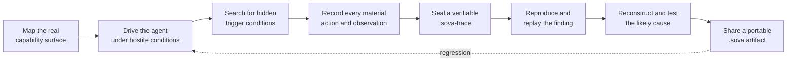
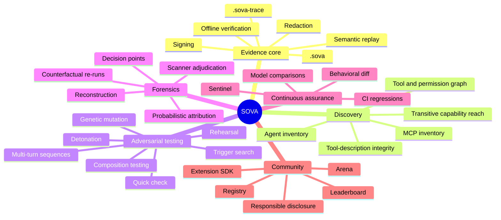
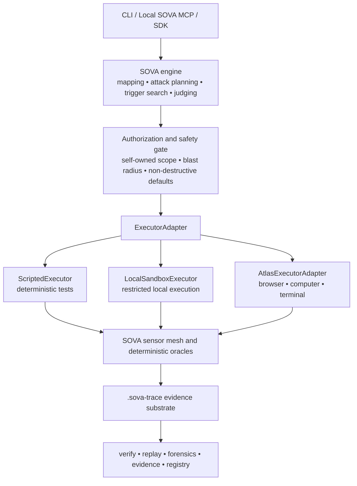

<p align="center">
  
</p>

<h1 align="center">S.O.V.A.</h1>

<p align="center">
  <strong>The open-source system of record for AI-agent security.</strong>
</p>

<p align="center">
  Map what an agent can reach. Test how it breaks. Capture what happened.<br/>
  Reproduce the finding. Explain the cause. Share evidence others can verify.
</p>

<p align="center">
  <a href="https://truscor.org"></a>
  <a href="https://github.com/Gautam-R-Patil/S.O.V.A---OSS---TRUSCOR"></a>
  
  
  
</p>

<p align="center">
  <a href="#why-sova">Why SOVA</a> •
  <a href="#what-sova-is-building">Capabilities</a> •
  <a href="#how-the-system-fits-together">System</a> •
  <a href="#the-planned-developer-experience">Usage</a> •
  <a href="#safety-by-construction">Safety</a> •
  <a href="#project-status">Status</a> •
  <a href="#connect">Connect</a>
</p>

<br/>

<p align="center">
  
</p>

---

> [!IMPORTANT]
> **SOVA is under active development.** This repository currently presents the product direction and public identity. The commands and interfaces below describe the intended developer experience; they must not be interpreted as a released package or completed security capability.

## Why SOVA

AI agents do more than generate text. They browse, execute commands, call MCP servers, use tools, read and write memory, retrieve private context, modify files, operate interfaces, and delegate work to other agents.

That creates a new security problem:

- A static scanner can inspect what a component **looks like**.
- A one-shot test can observe what it did **once**.
- A recorder can preserve what happened **afterward**.
- A benchmark can test a fixed scenario that may already be known.

But the failures that matter can hide behind a particular phrase, file, tool order, permission, memory state, invocation count, previous conversation, or combination of individually harmless components.

SOVA is being built to connect the entire security loop:



SOVA is not intended to be another disconnected scanner. It is intended to become the shared evidence and experimentation layer underneath agent-security work.

## The owl

**Sova** means **owl** in Serbian and is the transliteration of the Russian word **сова**.

The owl represents the product we want to build:

- watchful enough to see the entire system;
- patient enough to find behavior that stays dormant;
- precise enough to distinguish evidence from assumption;
- independent enough to let anyone verify the result.

## What SOVA is building

SOVA is organized around one always-on evidence substrate and a set of connected security verbs.

<table>
  <tr>
    <td width="14%" align="center"><strong>RECORD</strong></td>
    <td><code>sova trace</code> captures model, tool, MCP, memory, retrieval, process, browser, computer, and egress activity into a versioned <code>.sova-trace</code>.</td>
  </tr>
  <tr>
    <td align="center"><strong>DISCOVER</strong></td>
    <td><code>sova map</code> inventories agents, tools, skills, MCP servers, identities, permissions, approval gates, egress paths, and transitive capability reach.</td>
  </tr>
  <tr>
    <td align="center"><strong>TEST</strong></td>
    <td><code>sova check</code>, <code>detonate</code>, <code>compose</code>, <code>rehearse</code>, and <code>arena</code> exercise components and complete agents inside controlled environments.</td>
  </tr>
  <tr>
    <td align="center"><strong>EXPLAIN</strong></td>
    <td><code>sova forensics</code> reconstructs the run, identifies decision points, and evaluates causal hypotheses through controlled counterfactual re-runs.</td>
  </tr>
  <tr>
    <td align="center"><strong>PROVE</strong></td>
    <td><code>sova verify</code>, <code>replay</code>, and <code>evidence</code> turn observations into reproducible, redaction-aware evidence—not unsupported assurance.</td>
  </tr>
  <tr>
    <td align="center"><strong>WATCH</strong></td>
    <td><code>sova sentinel</code>, behavioral <code>diff</code>, and CI regression testing detect when a model, component, permission, or tool update changes security behavior.</td>
  </tr>
  <tr>
    <td align="center"><strong>SHARE</strong></td>
    <td><code>sova registry</code>, <code>adjudicate</code>, and <code>disclose</code> make findings portable, reviewable, responsibly publishable, and independently reproducible.</td>
  </tr>
</table>

### The headline capability: find the sleeper

A component may behave safely for hundreds of runs and activate only when:

- a particular word appears;
- a file exists;
- the invocation counter reaches a threshold;
- the agent has accumulated a specific memory;
- one tool has already been called;
- the environment contains a particular secret or permission;
- an individually benign component is combined with another.

SOVA plans to search this **conditional-trigger space** systematically rather than running only a fixed attack list.

The public claim will be earned experimentally: SOVA must repeatedly find confirmed behavior that strong baselines miss before we say that it does.

### `.sova` — a portable adversarial artifact

A `.sova` file is planned as an open, versioned way to encode a complete agent-security scenario:

- target and compatibility requirements;
- authorization and safety constraints;
- preconditions and environment state;
- multi-turn interactions;
- mutation points;
- expected tool calls or state changes;
- deterministic and semantic success oracles;
- cleanup requirements;
- a declared reproduction procedure and known limitations.

The goal is simple: a vulnerability should become a file another person can inspect and run—not only a screenshot and a paragraph.

A `.sova` describes the experiment; it becomes the executable part of a confirmed vulnerability only when a separate finding cites supporting trace evidence.

### `.sova-trace` — the evidence record

A `.sova-trace` is planned to carry:

- ordered events and causal relationships;
- model, tool, MCP, memory, retrieval, process, network, browser, and computer observations;
- target, environment, methodology, taxonomy, model, and executor fingerprints;
- attack, judge, oracle, reproduction, and forensic context;
- redaction metadata;
- artifact hashes;
- a standard signed envelope and offline verification path.

SOVA will build on open telemetry and signing conventions rather than inventing private cryptography. Its claims will remain bounded by a published threat model.

The accepted [artifact meanings decision](./docs/decisions/0001-canonical-artifact-meanings.md) separates scenarios, target manifests, traces, maps, findings, reports, and registry entries so execution, observation, and judgment cannot be confused.

### Versioning without lock-in

The accepted [versioning and lossless-migration policy](./docs/decisions/0002-versioning-and-lossless-migration.md) is designed so a future SOVA release can continue reading every stable `.sova` version and migrate old artifacts forward without silent data loss.

The promise is deliberately precise:

- the original file is never overwritten by default;
- every source value, payload, attachment, ordering rule, oracle, and safety constraint is preserved;
- implicit old defaults become explicit equivalent values;
- future-only information that did not exist is marked `unknown`, never fabricated;
- unsupported required behavior fails closed;
- the migrated artifact keeps provenance to the original digest but receives its own digest and signature.

The planned local workflow is:

```bash
sova migrate scenario.sova --check
sova migrate scenario.sova --to latest --require-lossless
```

SOVA will use experimental `0.x` schemas until real scenarios, migration rehearsals, independent implementations, and hostile-input tests justify `1.0.0`.

### Semantic reproduction

Hosted model execution is not reliably bit-for-bit deterministic. SOVA therefore separates:

1. **Trace playback** — inspect exactly what was recorded.
2. **Controlled re-execution** — rerun under pinned or equivalent conditions.
3. **Semantic reproduction** — test whether the same material security outcome recurs.

Instead of hiding nondeterminism, SOVA plans to report repeated trials, condition drift, and a reproduction rate.

## Capability map



## How the system fits together

SOVA owns the security method and evidence. Execution providers remain replaceable.



### Atlas MCP

[Atlas MCP](https://github.com/XAGI-Lab/atlas-mcp), created by [XAGI Labs](https://xagilabs.com), is planned as an optional execution adapter for:

- browser use;
- computer use;
- terminal use.

SOVA does **not** outsource its sandboxing, authorization, trigger search, observations, judging, redaction, signing, replay, forensics, or reporting to Atlas. The SOVA core must work with scripted and local executors before Atlas is connected.

## Planned features

### Discover

- Agent, sub-agent, skill, plugin, MCP server, and tool inventory.
- Declared, observed, and inferred capability graph.
- Identity, credential, permission, approval, and egress paths.
- Transitive “tools of tools” reach.
- Risk-classified attack-surface denominator.
- Tool-description and schema rug-pull detection.

### Test

- Sixty-second bounded component check with an explicit detection floor.
- Isolated detonation with synthetic secrets, files, databases, APIs, and services.
- Canary credentials and sink-only network honeypots.
- Multi-turn adversarial sequences.
- Conditional-trigger search across content, state, timing, invocation count, memory, filesystem, permission, and composition.
- Genetic/evolutionary mutation from successful and near-successful attempts.
- Composition testing for emergent chains.
- Safe rehearsal of real tasks against credential-stripped environment clones.
- Standard comparable profile and fully customizable non-comparable profile.

### Observe and judge

- Deterministic file, process, network, tool, permission, page, API, database, and canary oracles.
- Memory, retrieval, MCP, inter-agent, browser, and computer sensors.
- Independent Attacker and Judge roles.
- Rule and deterministic evidence before model judgment.
- Inconclusive and uncertainty states instead of forced verdicts.
- Adversary-effort metrics: turns, tokens, time, attempts, and mutations to success.

### Explain

- Cross-layer timeline reconstruction.
- Decision-point highlighting.
- Competing causal hypotheses.
- Counterfactual reruns with one candidate layer changed.
- Probabilistic attribution to model, prompt, orchestration, tool, permission, memory, handoff, or environment.
- Explicit sensor gaps and confounding factors.

### Prove and reproduce

- Portable adversarial scenarios.
- Signed, timestamped, redaction-aware traces under a stated threat model.
- Offline verification.
- Controlled re-execution.
- Semantic reproduction rate.
- Technical evidence packages with methodology and taxonomy versions.
- Self-assessment watermarking—never a self-issued certificate.

### Watch and share

- Behavioral regression diffing.
- Local sentinel runs.
- CI policy and pull-request evidence.
- Public, mirrorable registry of reviewed `.sova` artifacts.
- Execution-based scanner adjudication.
- Coordinated disclosure workflow.
- Reproducible component and model leaderboard.
- Local Arena and CTF modes.
- Captioned replay clips linked to verifiable artifacts.

## The planned developer experience

The intended workflow is deliberately small:

```bash
# Planned commands — not yet released

# 1. Configure a model provider or a local model
sova init

# 2. Discover what an agent can actually reach
sova map ./my-agent

# 3. Run a bounded component check
sova check ./some-component

# 4. Hunt for conditional behavior on an authorized target
sova detonate ./my-agent --hunt-triggers --authorize

# 5. Verify and replay portable evidence
sova verify ./run.sova-trace
sova replay ./scenario.sova --target ./my-agent

# 6. Reconstruct an incident
sova forensics ./incident.sova-trace

# 7. Rehearse a real task inside a safe clone
sova rehearse ./my-agent --task "process refund #4471"
```

The target experience:

- one install;
- one locally stored model configuration;
- no SOVA account;
- no mandatory SOVA server;
- no silent telemetry;
- local or user-chosen model inference;
- cached registry and local-model support for air-gapped environments.

## Built for different users

<table>
  <tr>
    <th>Developer</th>
    <th>Security engineer</th>
    <th>Researcher</th>
    <th>Platform / compliance team</th>
  </tr>
  <tr>
    <td>Check a component before installation and catch behavioral regressions in CI.</td>
    <td>Map capability reach, detonate safely, hunt triggers, and reconstruct incidents.</td>
    <td>Replace bespoke harnesses with portable scenarios, traces, repeated trials, and publishable artifacts.</td>
    <td>Generate versioned technical evidence from the same traces produced during testing.</td>
  </tr>
</table>

## Safety by construction

SOVA is a dual-use security project. Safety cannot be a disclaimer placed after implementation.

The intended controls are:

- **Self-owned scope by default.**
- **Proof of control**, not a URL assertion.
- **Explicit out-of-band human authorization for every offensive MCP invocation.**
- **Disposable isolation** for detonation.
- **Synthetic credentials and data** instead of production secrets.
- **Sink-only network behavior** for suspected-malicious components.
- **Non-destructive proof by default.**
- **Separate authorization for irreversible effects.**
- **Blast-radius, time, process, network, file, token, and mutation limits.**
- **Coordinated disclosure before naming affected components.**
- **No autonomous patching or pull requests.**
- **No claim that a bounded search proves universal safety.**

> [!WARNING]
> No offensive capability will be exposed through the SOVA MCP interface until the every-invocation human authorization mechanism exists and passes adversarial testing.

## What SOVA will not claim

A short test cannot prove an agent safe. A sandbox cannot guarantee that it triggered every environment-gated behavior. An unbounded trigger space cannot be searched completely.

SOVA will publish its detection floor, including:

- anti-sandbox behavior;
- conditions absent from the synthetic environment;
- very-long-fuse activation;
- unsupported internal state;
- model and provider nondeterminism;
- bounded search horizon;
- incomplete sensors;
- probabilistic causal attribution.

The output should say what was observed, under which conditions, for how long, and with what uncertainty.

## Research programme

SOVA is intended to produce both software and reproducible research.

The principal research directions are:

1. Conditional-trigger search for black-box agent components.
2. Execution-based adjudication of scanner disagreement.
3. Counterfactual fault attribution for agent-security incidents.
4. Portable `.sova` artifacts and semantic reproduction rates.
5. Model-swap vulnerability transferability.
6. The limits of agent detonation.
7. Redaction-preserving verifiable evidence.
8. A unified sensor mesh for memory, retrieval, MCP, and inter-agent state.

Research claims will require predeclared protocols, strong baselines, repeated trials, ground truth, uncertainty, ethics review, and reproducible artifacts. Paper and patent decisions will be made before irreversible public disclosure.

## Project status

| Area | Status |
|---|---|
| Vision and scope | Defined |
| Public identity and README | In progress |
| Canonical artifact meanings | Accepted in [ADR-0001](./docs/decisions/0001-canonical-artifact-meanings.md) |
| `.sova` meaning and migration invariants | Accepted in [ADR-0001](./docs/decisions/0001-canonical-artifact-meanings.md) and [ADR-0002](./docs/decisions/0002-versioning-and-lossless-migration.md) |
| `.sova` field schema | Experimental work has not started |
| `.sova-trace` experimental contract | Not yet implemented |
| Scripted/local execution | Not yet implemented |
| Atlas adapter | Awaiting validated integration |
| Sleeper demonstration | Not yet implemented |
| CLI / SDK / local MCP | Not yet implemented |
| Registry and community surfaces | Not yet implemented |

The first engineering objective is a no-Atlas vertical slice:

```text
planted sleeper component
    → restricted synthetic environment
    → hidden-trigger search
    → deterministic canary/egress oracle
    → signed .sova-trace
    → offline verification
    → replay and repeated reproduction
    → honest technical report
```

## Open-source and commercial boundary

SOVA OSS is designed to help users test and understand **their own systems**.

- SOVA produces operator-controlled evidence and self-assessments.
- SOVA does not issue a TRUSCOR certificate or independent attestation.
- SOVA does not produce financial loss, underwriting, premium, or insurance conclusions.
- SOVA does not contain TRUSCOR’s private corpus, client-confidential findings, or proprietary commercial risk models.

The separation protects the credibility of both projects: evidence can be open; independent trust cannot be self-issued.

## Contributing

The project is pre-alpha. Public contribution rules, dual-use policy, security policy, and coordinated-disclosure process will be added before executable offensive capabilities or registry submissions are accepted.

Future contribution areas will include:

- target and framework adapters;
- deterministic oracles;
- sandbox backends;
- trace importers and exporters;
- safe vulnerable fixtures;
- `.sova` scenarios;
- provider integrations;
- replay and visualization;
- documentation and reproducibility.

Until the security contribution process is published, please do not open public issues containing live credentials, private traces, unpatched exploit payloads, or confidential target information.

## Connect

<table>
  <tr>
    <td><strong>SOVA / TRUSCOR</strong></td>
    <td><a href="https://truscor.org">truscor.org</a></td>
  </tr>
  <tr>
    <td><strong>Project lead</strong></td>
    <td><a href="mailto:gautam@truscor.org">gautam@truscor.org</a></td>
  </tr>
  <tr>
    <td><strong>XAGI Labs</strong></td>
    <td><a href="https://xagilabs.com">xagilabs.com</a></td>
  </tr>
  <tr>
    <td><strong>XAGI Labs on GitHub</strong></td>
    <td><a href="https://github.com/XAGI-Lab">github.com/XAGI-Lab</a></td>
  </tr>
  <tr>
    <td><strong>SOVA repository</strong></td>
    <td><a href="https://github.com/Gautam-R-Patil/S.O.V.A---OSS---TRUSCOR">Gautam-R-Patil/S.O.V.A---OSS---TRUSCOR</a></td>
  </tr>
</table>

---

<p align="center">
  <picture>
    <source media="(prefers-color-scheme: dark)" srcset="./assets/truscor-mark-dark.svg">
    <source media="(prefers-color-scheme: light)" srcset="./assets/truscor-mark-light.svg">
    
  </picture>
</p>

<p align="center">
  
</p>

<p align="center">
  <strong>See the agent. Find the condition. Preserve the evidence.</strong>
</p>

<p align="center">
  Built in the open by <a href="https://truscor.org">TRUSCOR</a>, with execution infrastructure from the wider <a href="https://xagilabs.com">XAGI Labs</a> ecosystem.
</p>
