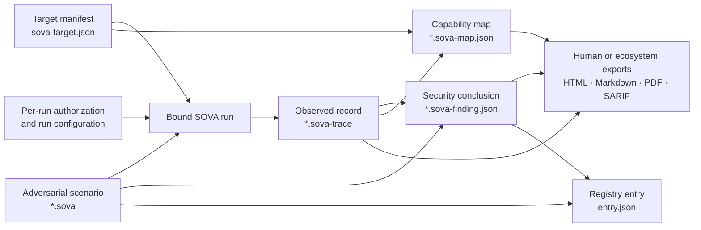

# ADR-0001: Canonical SOVA artifact meanings

- **Status:** Accepted
- **Decision date:** 2026-07-29
- **Roadmap scope:** Topic 00.2 — Artifact meaning
- **Supersedes:** Any use of `.sova` as a generic agent configuration, map output, trace, finding, or report

## Decision

SOVA uses one artifact name for one semantic job.

The execution plan, target declaration, observed evidence, security conclusion, presentation, and registry metadata are separate objects. They may reference one another by immutable digest, but none may silently change into another type.

This decision freezes the meanings and working names below. It does **not** freeze their complete field schemas, container encodings, or a `1.0` compatibility promise; those belong to Topics 00.3, 04, and 05.

## Canonical artifact set

| Artifact | Working filename | Canonical role | Execution policy | Default sharing posture |
|---|---|---|---|---|
| SOVA scenario | `*.sova` | Portable adversarial experiment: interactions, preconditions, mutation points, expected effects, oracles, safety limits, and cleanup | Executable only by an explicit SOVA run command after validation, target binding, and authorization | Shareable after safety and disclosure review |
| Target manifest | `sova-target.json` | Local declaration of the target interface, adapters, entry points, expected capabilities, and secret references | Inert; loading or validating it must not contact or operate the target | Local by default |
| Target authoring view | `sova-target.yaml` | Optional human-friendly source compiled into the canonical JSON target manifest | Inert; safe YAML parsing only | Local by default |
| Execution trace | `*.sova-trace` | Canonical record of one run: ordered observations, causal links, input digests, environment fingerprints, redactions, artifacts, and integrity material | Always inert; trace playback is inspection, never re-execution | Private by default; explicitly redacted for sharing |
| Map report | `*.sova-map.json` | Machine-readable inventory and capability graph with declared, observed, and inferred reach plus provenance | Inert | Private by default |
| Finding | `*.sova-finding.json` | One versioned security conclusion supported by one or more traces and a scenario digest | Inert | Private or embargoed until explicitly disclosed |
| Human report | `*.html`, `*.md`, or `*.pdf` | Derived presentation of maps, findings, traces, methods, and limitations | Inert and non-canonical | Explicit export only |
| Registry entry | `entry.json` in a versioned registry path | Inert discovery and lifecycle metadata pointing to immutable scenario content and verification records | Inert; registry browsing and sync never execute scenarios | Public only after registry review |

Every machine-readable artifact will carry an explicit type discriminator such as `sova.scenario`, `sova.target`, `sova.trace`, `sova.map`, `sova.finding`, or `sova.registry-entry`. Topic 00.3 will settle the version fields and compatibility contract.

## Normative meanings

### 1. `.sova` is a scenario, not a verdict

A `.sova` artifact is the portable unit of adversarial intent. It describes a bounded experiment that SOVA can inspect, validate, bind to a compatible target, and execute.

It may contain:

- ordered single-turn or multi-turn interactions;
- adversarial prompt, tool, file, browser, computer, or protocol payload data;
- preconditions, trigger conditions, and bounded mutation domains;
- expected observations, effects, and oracle definitions;
- required sensors and executor capabilities;
- safety constraints, forbidden effects, budgets, cleanup, and reset rules;
- a declared reproduction procedure and known limitations;
- content-addressed fixtures or attachments.

It must not contain:

- live credentials, session tokens, or raw private target data;
- proof that a target is owned or that a specific run is authorized;
- mutable observed reproduction counts or community verification status;
- the authoritative events from a run;
- a claim that a vulnerability has been confirmed merely because the scenario exists.

A `.sova` file can therefore be a safe regression test, a research scenario, a candidate exploit, or the executable component of a confirmed vulnerability. It becomes a **portable vulnerability artifact** only when a finding with the required evidence and lifecycle status cites its digest.

### 2. `sova-target.json` is the target declaration

The target manifest describes how SOVA may identify and connect to the system under test. It is not the agent's native configuration format and does not replace one. It may reference and fingerprint native configuration, MCP schemas, skills, plugins, model settings, or deployment metadata.

The manifest may declare:

- target identity and target class;
- adapter and entry-point configuration;
- expected tools, permissions, interfaces, and capabilities;
- compatibility constraints;
- references to secrets held in an approved external secret provider;
- local fixture or sandbox requirements.

The manifest must not embed secret values. It must not be treated as proof of ownership or authorization. Per-run authorization is a separate input that is captured in the resulting trace.

JSON is the canonical interchange representation because it has a mature validation ecosystem and a deterministic path to hashing. YAML may be accepted for authoring convenience, but SOVA must parse it with a safe schema, reject ambiguous constructs, convert it to canonical JSON before execution, and record the canonical digest.

### 3. `.sova-trace` is the observed record

A `.sova-trace` records what SOVA observed during one run. It binds the run to the exact scenario, target-manifest snapshot, run configuration, authorization decision, methodology, taxonomy, executors, sensors, model/provider identity, and relevant environment fingerprints.

A sealed trace includes:

- ordered events and causal relationships;
- hashes of referenced inputs and captured artifacts;
- recorder and executor identity;
- redaction and omission declarations;
- completion state, including success, failure, cancellation, timeout, crash, or partial capture;
- a typed signed envelope and the material needed for supported offline verification.

A trace is evidence, not a verdict. A valid signature establishes integrity and signer provenance under the published threat model; it does not establish that the target was honestly instrumented, that an oracle is correct, or that the behavior constitutes a vulnerability.

An interrupted run may leave an explicitly **partial and unsealed** trace. It remains inspectable but cannot be represented as sealed or independently verified.

### 4. `*.sova-map.json` is the capability map

A map report is a derived inventory and graph. It distinguishes:

- declared reach;
- directly observed reach;
- inferred or transitive reach;
- unknown or unverified edges.

Every edge must carry provenance to the source declaration or trace observation that supports it. A map report does not assert that an exploit was executed, and importing a map must never grant permissions or silently convert it into a target manifest.

The earlier generic `map-<date>.sova` name is retired. The canonical machine-readable form is `*.sova-map.json`; optional human renderings are reports.

### 5. `*.sova-finding.json` is the security conclusion

A finding is the smallest canonical claim that a security-relevant behavior was observed, reproduced, not observed, disputed, fixed, or otherwise bounded.

It references:

- the scenario digest;
- one or more trace digests;
- the affected target/component identities and versions;
- the oracle and judge versions;
- the finding lifecycle state;
- technical severity, confidence, uncertainty, and limitations;
- reproduction statistics derived from named runs;
- disclosure, correction, supersession, and external-identifier metadata.

Observed reproduction rates belong in the finding or registry verification records, not in the immutable scenario. This prevents new trials from changing the identity of the test definition.

A finding is still a SOVA self-assessment unless a genuinely independent party separately attests to it. It is never a TRUSCOR certificate or underwriting conclusion.

### 6. Reports are views, not evidence roots

HTML, Markdown, PDF, SARIF, STIX, and other exports are derived views. They are useful for humans and external systems, but the canonical references remain the source map, finding, trace, and scenario digests.

A report may omit or summarize data. It must say what it was generated from and must not imply that the report file itself contains the complete evidence chain.

### 7. A registry entry is an index, not an executable

A registry entry makes a scenario discoverable without changing its identity. It points to an immutable `.sova` digest and may include:

- name, version, authorship, licence, taxonomy, and compatibility metadata;
- disclosure and safety-review state;
- deprecation, revocation, withdrawal, or supersession state;
- signed verification or reproduction attestations;
- aggregate reproduction information derived from referenced evidence.

Mutable registry metadata must never be embedded into the scenario in a way that changes the scenario digest. Pulling, browsing, verifying, or rendering a registry entry must never execute the referenced `.sova`.

## Relationship model

The binding rules are:

1. A run binds an exact scenario digest to an exact target-manifest digest and a fresh authorization decision.
2. A trace records that binding and the resulting observations.
3. A finding cites immutable scenario and trace digests; it never copies their authority by filename alone.
4. A map cites its declaration and observation sources.
5. Reports render canonical artifacts without replacing them.
6. Registry entries index immutable content and attach mutable lifecycle or verification metadata separately.

## Execution and payload policy

Only `.sova` has executable **intent**, and even it is not an operating-system executable.

The core `.sova` format is declarative. Payloads are data interpreted through named SOVA actions and adapters. A `.sova` must never auto-run when it is opened, parsed, linted, rendered, imported, synchronized, or signature-verified.

Arbitrary host-native scripts, package-install hooks, macros, and active documents are prohibited in the core artifact. If a future use case genuinely requires programmable extensions, Topic 04 must define a separate, content-addressed extension artifact with all of the following:

- explicit capability declarations;
- a restricted sandbox such as a constrained WebAssembly runtime;
- no ambient filesystem, process, credential, or network access;
- signature and digest verification;
- explicit operator opt-in for every run;
- deterministic resource limits and a fail-closed unsupported path.

Until that separate design passes its safety gate, arbitrary code inside `.sova` is invalid.

All other canonical artifacts are inert:

- target manifests may name adapters but cannot contain or invoke adapter code;
- traces may record malicious strings or bytes but viewers must escape them and never execute active content;
- maps and findings may reference a scenario but cannot launch it;
- reports must not contain active scripts by default;
- registry entries and sync operations must not auto-fetch unresolved links or execute hooks.

## Identity and reference rules

Every canonical machine-readable artifact will use three layers of identity:

1. **Logical identity** — stable identity across revisions.
2. **Declared version** — author-meaningful compatibility or lifecycle version.
3. **Content digest** — exact immutable bytes used by a run or verification decision.

Cross-artifact references must carry at least the artifact kind, digest algorithm, digest, and byte size. Human-readable names and URLs are locators, never identity. Consumers must verify bytes before parsing expensive or untrusted content.

This follows the proven content-descriptor pattern used by OCI while keeping SOVA independent of any required hosted registry.

## Standards fit

SOVA will interoperate with existing standards without forcing an ill-fitting standard to become its native object model:

| Standard | What SOVA should reuse | Why it is not the canonical SOVA artifact |
|---|---|---|
| [CACAO Security Playbooks 2.0](https://docs.oasis-open.org/cacao/security-playbooks/v2.0/security-playbooks-v2.0.html) | Workflow, target, variable, data-marking, and extension design lessons | A SOVA scenario needs agent conversations, adaptive mutations, security oracles, observation requirements, and reproduction semantics |
| [Atomic Red Team](https://www.atomicredteam.io/docs/atomic-red-team) | Simple test metadata, prerequisites, executors, inputs, and cleanup lessons | Atomic tests focus on compact endpoint-control tests rather than stateful agent behavior and signed evidence |
| [JSON Schema 2020-12](https://json-schema.org/specification) | Structural validation for canonical JSON artifacts | Validation does not define SOVA semantics, safety, or integrity |
| [OCI content descriptors](https://github.com/opencontainers/image-spec/blob/main/descriptor.md) | Media type, digest, size, and content-addressed references | OCI remains an optional distribution mechanism, not a required runtime or container format |
| [OpenTelemetry traces](https://opentelemetry.io/docs/specs/otel/trace/api/) | Spans, events, links, resource identity, and observability export | Ordinary telemetry does not by itself capture SOVA authorization, adversarial intent, evidence completeness, redaction, or forensic claims |
| [in-toto Statement v1](https://github.com/in-toto/attestation/blob/main/spec/v1/statement.md) | Digest-bound subjects and typed predicates for verification attestations | It is an attestation envelope, not the event record or adversarial scenario |
| [DSSE](https://github.com/secure-systems-lab/dsse) and [Sigstore bundles](https://docs.sigstore.dev/about/bundle/) | Type-bound signatures and portable verification material | Signing proves integrity and provenance under a trust policy; it does not define trace truth |
| [SARIF 2.1.0](https://docs.oasis-open.org/sarif/sarif/v2.1.0/os/sarif-v2.1.0-os.html) | Export of compatible findings into developer and code-scanning systems | SARIF is optimized for analysis results and locations, not complete multi-turn execution evidence |

Topic 05 must pin exact OpenTelemetry, DSSE, in-toto, and Sigstore versions before implementation. Topic 16 owns SARIF and other export mappings.

## Alternatives rejected

### Use `.sova` for every SOVA output

Rejected because type ambiguity creates parser-confusion risk, makes trust policy unclear, and prevents tools from knowing whether a file is executable intent, evidence, or a conclusion.

### Define `.sova` as an agent configuration

Rejected because a target configuration changes per deployment while an adversarial scenario should remain portable across compatible targets. The separate target manifest preserves that portability.

### Treat a `.sova` file as a confirmed vulnerability

Rejected because the existence of a test does not prove a failure. Confirmation belongs to a finding supported by trace evidence.

### Put the verdict inside the trace

Rejected because observations and interpretations have different lifecycles. A finding can be corrected, disputed, or superseded without rewriting the historical trace.

### Use SARIF, STIX, CACAO, or OpenTelemetry unchanged as the native format

Rejected because each solves a valuable but narrower interoperability problem. SOVA should export to or borrow from them while retaining agent-specific experiment and evidence semantics.

### Permit arbitrary scripts directly inside `.sova`

Rejected because importing a community scenario would become equivalent to accepting arbitrary code execution. The declarative core preserves inspectability and supports enforceable capability limits.

## Consequences

- Existing examples and documentation must stop using `.sova` for map reports or agent configuration.
- Topic 00.3 can version each artifact family independently while sharing common identity and reference rules.
- Topic 04 can design `.sova` without also becoming a target-config, result, or registry schema.
- Topic 05 can design `.sova-trace` as an inert evidence package and define what sealing proves.
- Topic 09 owns `*.sova-map.json`.
- Topic 16 owns `*.sova-finding.json` and all human/ecosystem exports.
- Topic 20 owns `entry.json`, registry layout, and verification tiers.
- Parsers and commands must reject an artifact whose extension, declared kind, and detected media type disagree.

## Acceptance checks

- [x] `.sova` has one meaning: portable adversarial scenario.
- [x] `.sova-trace` has one meaning: canonical execution/evidence record.
- [x] Target configuration has a separate name and canonical JSON format.
- [x] Map output has a separate name and canonical JSON format.
- [x] Scenario, target, trace, map, finding, report, and registry relationships are explicit.
- [x] Exactly one core artifact has executable intent, and its execution boundary is explicit.
- [x] Mutable conclusions and registry verification state do not alter immutable scenario or trace identities.
- [x] The decision remains compatible with a no-Atlas executor and a later Atlas adapter.
