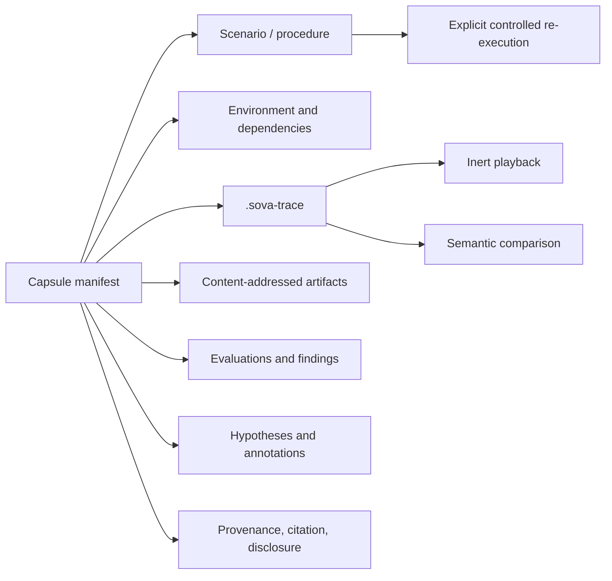

<!-- status: implemented -->

# `.sova` AI-behavior capsule 0.1

## Purpose

A `.sova` file is a small, portable, versioned, inert-by-default capsule for an
observed or hypothesized AI behavior. It can represent a vulnerability,
unexpected interaction, evaluation case, debugging record, interpretability
experiment, incident, behavioral comparison, or publication artifact.

The scenario/replay recipe remains a first-class typed object inside the
capsule. It is not the entire capsule and is not required for an
observation-only draft.

## Logical model



Actor, event, artifact, environment, procedure, evaluation, and provenance are
universal typed primitives. Domain profiles add recommendations without
changing the core:

| Profile | Typical content |
|---|---|
| `security` | Trigger, bounded attack procedure, safety rules, oracles, trace, finding |
| `evaluation` | Test procedure, assertions, scores, comparison runs |
| `agent-trajectory` | Messages, decisions exposed by the runtime, tools, memory, state |
| `behavioral-interpretability` | Behavior plus optional authorized activations, probes, or interventions |
| `incident-forensics` | Partial traces, custody, reconstruction, annotations, corrections |
| `research-publication` | Methods, fixtures, environments, results, citations, limitations |

The capture profile is independent:

- `lite`: manifest, procedure, key events, selected artifacts;
- `standard`: normal model/agent/tool timeline and fingerprints;
- `forensic`: expanded observations, custody, integrity, and redaction records;
- `interpretability`: standard material plus explicitly supported internal
  probes or interventions.

No profile claims to capture hidden chain-of-thought.

## Physical representation

Version `0.1.0` is a deterministic ZIP package:

```text
manifest.json
objects/scenario.json
objects/*.json
traces/*.sova-trace
blobs/sha256/<hex>
```

Only `manifest.json` is reserved. Every other member appears in `objects` with
`role`, `path`, `mediaType`, `digest`, and `size`. Readers MUST verify the
descriptor before parsing or rendering an object. Undeclared members, missing
members, duplicate names, absolute paths, traversal, backslashes, links,
devices, unsafe compression ratios, and configured size-limit violations MUST
fail.

Canonical JSON is UTF-8 with unique member names, RFC 8785 UTF-16 member
ordering, minimal separators, Unicode scalar values, exact I-JSON-range
integers, and no non-finite or binary floating-point values. Quantities that
need decimal precision use normalized decimal strings. SOVA deliberately uses
this strict JCS/I-JSON subset rather than claiming the full RFC 8785 number
serialization algorithm.

Three digests remain distinct:

- each object digest identifies exact object bytes;
- the content digest identifies the canonical manifest/root and its object
  descriptors;
- the package digest identifies exact transported ZIP bytes.

Compression changes may change the package digest without changing content
identity.

## Manifest invariants

The manifest records:

- stable logical identity, schema version, artifact version, title, and summary;
- authorship, provenance, source digests, and transformations;
- domain and capture profiles;
- lifecycle and disclosure state;
- compatibility for runtimes, models, tools, and platforms;
- required and optional feature identifiers;
- a fresh-authorization requirement for re-execution;
- safety impact, forbidden effects, cleanup, and limitations;
- licence and content descriptors;
- namespaced extensions.

The manifest MUST NOT contain live credentials. Target ownership and a capsule's
existence are not authorization. Every live re-execution obtains a new,
out-of-band authorization decision and records it in the new trace.

## Scenario semantics

`sova.scenario` declares portable intent:

- parameters and preconditions;
- ordered steps with named abstract actions;
- explicit reusable sequences, with calls that name the sequence and never
  hide its component steps;
- conditions, triggers, and bounded mutation domains;
- expected effects, deterministic oracles, and evidence requirements;
- budgets, forbidden effects, stop conditions, cleanup, and limitations;
- `x-<owner>` extensions.

An executor binds an abstract action to a mechanism. Executor-specific command
lines, browser drivers, provider SDK calls, or host paths do not become the
portable meaning.

Opening, inspecting, validating, linting, formatting, hashing, rendering,
migrating, importing, or downloading a capsule MUST NOT execute a step, fetch a
URL, install a dependency, invoke a model, or operate a target.

## Tooling

Implemented reference commands:

```text
sova template capsule output.json
sova template scenario scenario.json
sova pack manifest.json scenario.json behavior.sova
sova validate behavior.sova
sova lint behavior.sova
sova inspect behavior.sova
sova hash behavior.sova
sova hash behavior.sova --content
sova compat old.sova --to 0.1.0
sova migrate old.sova new.sova --to 0.1.0
```

`inspect` renders escaped inert Markdown. `lint` distinguishes valid but risky
authoring choices from structural failure. A capsule without a scenario is
valid for collection or incident work but is not re-executable.

## Lifecycle

Allowed lifecycle states are `draft`, `embargoed`, `disclosed`, `verified`,
`corrected`, `revoked`, `withdrawn`, and `superseded`.

- Verification adds a separately attributable reproduction record; it does not
  rewrite historical traces.
- Correction produces a new artifact version linked to the old digest.
- Withdrawal and supersession are terminal for that exact version.
- Mutable registry status does not change immutable capsule bytes.
- Licence, authorship, disclosure, and source provenance survive migration.

## Portability

A receiver can always inspect supported package bytes without installing the
recorded environment. Controlled re-execution requires capability negotiation.
Missing optional features degrade with a fidelity report. Missing required
features fail closed. Provisioning hints are informational and never
auto-install.

Exact replay is not promised across stochastic models, private provider
revisions, hardware, or unavailable dependencies. SOVA separately reports
trace playback, controlled re-execution, and semantic reproduction.

## Limitations

The `0.1.0` schema is experimental. The Python implementation and published
canonical vectors are not yet an independent cross-language implementation.
The format has not passed the ADR-0002 `1.0` evidence gate, a large
cross-runtime corpus, or ecosystem adoption requirements.
